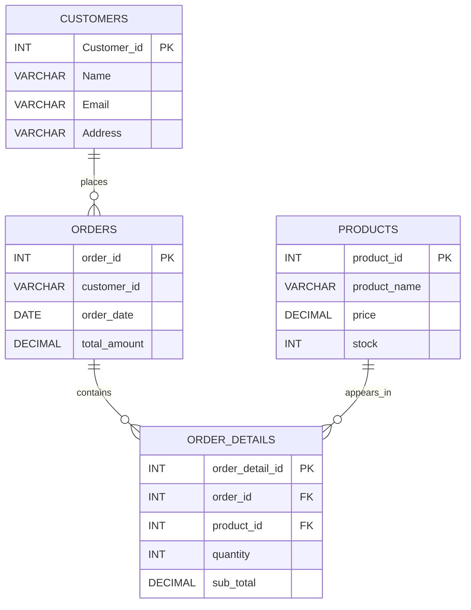

<div align="center">

# ⚡ DATA Digger
### `SQL • Database Engineering • Data Intelligence`

**👨‍💻 Created & Maintained by [Dixit Maru](https://github.com/Dixit2307)**

[](https://github.com/Dixit2307)


<br/>


</div>

---

## 🧬 What is Data Digger?

**Data Digger** is a hands-on SQL database project built around a small commerce system.

It demonstrates the complete journey:

```text
DATABASE
   ↓
TABLES
   ↓
RELATIONSHIPS
   ↓
SAMPLE DATA
   ↓
CRUD QUERIES
   ↓
AGGREGATIONS
   ↓
DATA ANALYSIS
```

The source project creates a `Data_Digger` database and works with **Customers, Orders, Products, and OrderDetails**. fileciteturn0file0L1-L9

---

## 🖥️ Project Matrix

| Module | Purpose | Core SQL |
|---|---|---|
| 👤 Customers | Customer master data | `CREATE`, `INSERT`, `SELECT`, `UPDATE`, `DELETE` |
| 🧾 Orders | Purchase/order records | `INSERT`, `SELECT`, `UPDATE`, `DELETE`, aggregates |
| 📦 Products | Product + inventory data | sorting, filtering, price analysis |
| 🔗 OrderDetails | Order ↔ Product bridge | `FOREIGN KEY`, `SUM`, `COUNT`, `GROUP BY` |

The project defines the customer table with `Customer_id` as the primary key, plus name, email and address fields. fileciteturn0file0L9-L14

---

## 🧠 Database Architecture



The source explicitly defines foreign keys from `order_details.order_id` to `orders.order_id` and from `order_details.product_id` to `products.product_id`. fileciteturn0file0L142-L152

---

## 🧪 Query Playground

### 👤 Customer Operations

```sql
-- Read
SELECT * FROM customers;

-- Update
UPDATE Customers
SET Address = 'Noida'
WHERE Customer_id = 1001;

-- Delete
DELETE FROM Customers
WHERE Customer_id = 1005;

-- Filter
SELECT *
FROM Customers
WHERE Name = 'Sumit';
```

These customer CRUD exercises are part of the supplied SQL project. fileciteturn0file0L25-L44

---

### 🧾 Order Intelligence

```sql
-- Customer-specific orders
SELECT *
FROM orders
WHERE customer_id = '1001';

-- Order analytics
SELECT
    MAX(total_amount) AS Highest,
    MIN(total_amount) AS Lowest,
    AVG(total_amount) AS Average
FROM Orders;
```

The source includes customer-specific order retrieval and `MAX()`, `MIN()`, and `AVG()` analysis. fileciteturn0file0L72-L74 fileciteturn0file0L89-L93

---

### 📦 Product Intelligence

```sql
-- Highest-priced products first
SELECT *
FROM products
ORDER BY price DESC;

-- Price-range filtering
SELECT *
FROM products
WHERE price >= 500
  AND price <= 2000;

-- Cheapest / most expensive values
SELECT
    MAX(price) AS Expensive,
    MIN(price) AS Cheap
FROM products;
```

The project uses product sorting, price filtering, and `MAX()`/`MIN()` analysis. fileciteturn0file0L122-L140

---

### 📊 Revenue Engine

```sql
-- Total revenue
SELECT SUM(sub_total) AS Total_Revenue
FROM order_details;

-- Top 3 products by quantity sold
SELECT
    product_id,
    SUM(quantity) AS Total_sold
FROM order_details
GROUP BY product_id
ORDER BY Total_sold DESC
LIMIT 3;

-- Product sales count
SELECT COUNT(*) AS Total_Times_Sold
FROM order_details
WHERE product_id = 120;
```

The supplied project includes revenue aggregation, top-3 product analysis, and product sales counting. fileciteturn0file0L173-L186

---

## 🛰️ Data Flow

```text
                    ┌─────────────────┐
                    │  DATA Digger DB │
                    └────────┬────────┘
                             │
              ┌──────────────┼──────────────┐
              ▼              ▼              ▼
        ┌──────────┐   ┌──────────┐   ┌──────────┐
        │ Customers│   │  Orders  │   │ Products │
        └─────┬────┘   └─────┬────┘   └─────┬────┘
              │              │              │
              │              └──────┬───────┘
              │                     ▼
              │              ┌──────────────┐
              └─────────────►│ OrderDetails │
                             └──────┬───────┘
                                    │
                                    ▼
                         ┌────────────────────┐
                         │ ANALYZE & DISCOVER │
                         └────────────────────┘
```

---

## 📈 SQL Skill Radar

```text
████████████████████  Database Creation
████████████████████  Table Design
██████████████████░░  CRUD Operations
██████████████████░░  Filtering & Sorting
████████████████░░░░  Aggregate Functions
███████████████░░░░░  GROUP BY Analysis
██████████████░░░░░░  Relational Modeling
██████████████░░░░░░  Foreign Keys
```

> **Mission:** Don't just store data. **Interrogate it.**

---

## 🧩 Dataset Snapshot

### Customers

The supplied dataset contains five sample customer records, including `Sumit`, `Asha`, `Nisha`, `Ajay`, and `Parth`. fileciteturn0file0L16-L21

### Orders

Five sample orders are included with dates from **2026-06-02** through **2026-06-15**, with amounts ranging from `20000` to `35000`. fileciteturn0file0L62-L69

### Products

The sample products include **Laptop, Mobile, Headphones, Keyboard, and Monitor**, with stock and pricing fields. fileciteturn0file0L111-L118

### Order Details

The project includes five sample order-detail records connecting orders to products with quantities and subtotals. fileciteturn0file0L160-L167

---

## ⚙️ Tech Stack


---

## 🚀 Run the Project

### 01 — Open SQL environment

Use a MySQL-compatible SQL environment.

### 02 — Create the database

```sql
CREATE DATABASE IF NOT EXISTS Data_Digger;
```

The database creation statement is present in the supplied SQL source. fileciteturn0file0L5-L9

### 03 — Build the schema

Create:

```text
Data_Digger
├── customers
├── orders
├── products
└── order_details
```

### 04 — Load sample data

Run the provided `INSERT` statements.

### 05 — Explore

Execute the query sections and experiment with:

```text
SELECT
WHERE
ORDER BY
UPDATE
DELETE
MAX()
MIN()
AVG()
SUM()
COUNT()
GROUP BY
LIMIT
FOREIGN KEY
```

---

## 🔍 What You Can Learn

```text
✓ Database creation
✓ Table creation
✓ Primary keys
✓ Foreign keys
✓ Data insertion
✓ Data retrieval
✓ Data modification
✓ Data deletion
✓ Filtering
✓ Sorting
✓ Aggregate functions
✓ Grouped analysis
✓ Revenue calculation
✓ Product ranking
✓ Relational database thinking
```

---

## 🧠 NextGen Challenge Mode

Want to push this project further?

```text
[ LEVEL 01 ]  Add more customers
[ LEVEL 02 ]  Add more products
[ LEVEL 03 ]  Build JOIN queries
[ LEVEL 04 ]  Create monthly revenue analysis
[ LEVEL 05 ]  Find repeat customers
[ LEVEL 06 ]  Build customer spending rankings
[ LEVEL 07 ]  Create inventory alerts
[ LEVEL 08 ]  Turn SQL results into a dashboard
```

### ⚡ Final Boss

Build a complete **SQL → Python → Power BI** analytics pipeline.

```text
MySQL
  ↓
Python / Pandas
  ↓
Data Cleaning
  ↓
EDA
  ↓
Power BI
  ↓
Interactive Dashboard
  ↓
Business Insight
```

---

## 👨‍💻 Developer — Dixit Maru

> **NextGen Developer • SQL Learner • Data Explorer**
>
> 🐙 GitHub: **[Dixit2307](https://github.com/Dixit2307)**

---

## 🧑‍💻 Developer Mode

```bash
$ whoami
dixit-maru

$ mission
turn_raw_data_into_intelligence

$ weapon
SQL

$ mindset
learn → query → break → debug → improve

$ status
████████████████████  ONLINE
```

---

<div align="center">

### `DATA IS EVERYWHERE.`
### `THE SKILL IS KNOWING HOW TO ASK IT THE RIGHT QUESTION.`

<br/>


**Built by [Dixit Maru](https://github.com/Dixit2307) ⚡ SQL + curiosity + persistence**

[⭐ Follow Dixit2307 on GitHub](https://github.com/Dixit2307)

</div>
